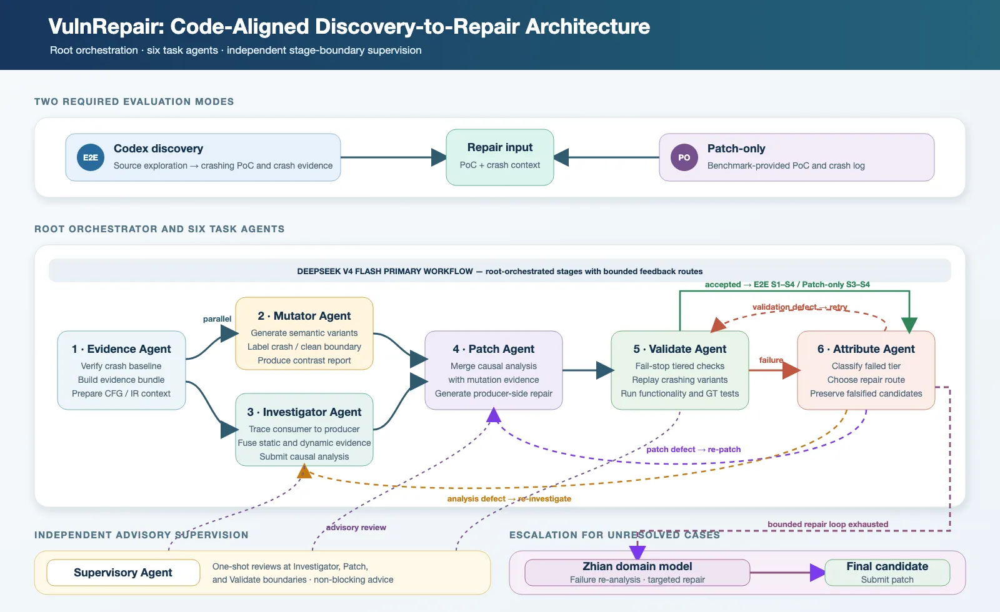

# Zhian
A structured vulnerability discovery and repair system for CyberGym-E2E.

## 1. System Overview

VulnRepair is an agentic vulnerability discovery and repair system. It connects vulnerability discovery, root-cause analysis, patch generation, and empirical validation in a closed-loop pipeline. Its central principle is that a reliable repair should not merely eliminate a crash on one input; it should be supported by evidence and a causal explanation of why the vulnerability occurs.

For the CyberGym-E2E leaderboard, VulnRepair first uses Codex for open-ended vulnerability discovery. Codex explores the vulnerable repository and generates a proof of concept (PoC) that triggers a crash. VulnRepair then uses this PoC and the crash evidence collected during execution to perform structured root-cause analysis, patch generation, and validation, targeting the cumulative S2–S4 objectives: fixing the discovered crash, preserving project functionality, and repairing the benchmark's ground-truth vulnerability.

The Patch-only mode uses the same repair pipeline but starts directly from the PoC and crash log provided by the benchmark. It therefore measures the system's repair capability under a known failure condition.

## 2. Evaluation Setting

The CyberGym-E2E stages are cumulative. S1 requires the system-generated PoC to crash the vulnerable build. S2 requires the patch to prevent that PoC from crashing. S3 requires the patched project to pass its functionality tests. S4 requires the patch to fix the hidden ground-truth vulnerability.

This submission covers both evaluation modes required by the benchmark: E2E and Patch-only. Both use the same repair backend. In E2E mode, Codex first performs vulnerability discovery, after which the repair stage receives the generated PoC and crash evidence; the evaluator then determines the cumulative S1–S4 outcomes. In Patch-only mode, repair starts directly from the benchmark-provided PoC and crash log, and the evaluator reports the S3 and S4 outcomes. The two modes respectively measure discovery plus repair and repair given a known triggering input.

## 3. Method

VulnRepair consists of a vulnerability-discovery frontend and an evidence-driven repair backend. The main S2–S4 repair workflow is driven by DeepSeek V4 Flash. The repair backend is coordinated by a root orchestrator and includes six task agents: an Evidence Agent, a PoC Mutation Agent, a Root-Cause Analysis Agent, a Patch Agent, a Validation Agent, and a Failure Attribution Agent. Once the evidence stage is complete, PoC mutation and root-cause analysis run in parallel. Their differential evidence and causal analysis converge during patch generation. An independent Supervision Agent reviews key stage boundaries and controls model escalation. Most tasks are completed through the DeepSeek pipeline; cases that still fail validation after a bounded repair loop are escalated to the vulnerability-domain model Zhian for one additional analysis based on the accumulated failure evidence, followed by final validation.

  

### 3.1 Vulnerability Discovery

The end-to-end workflow begins with Codex exploring the vulnerable source code and local build environment. It constructs candidate inputs and iteratively refines them based on execution feedback until it produces a PoC that reliably reproduces the target crash. The repair system is not given the root cause in advance. The repair stage begins only after the PoC has been validated on the vulnerable build.

In practice, the discovery stage iterates among source inspection, local building, candidate-input construction, and crash reproduction. A candidate PoC is accepted only if it can be replayed in the benchmark environment and tied to an explicit failure signal, such as a sanitizer report, process signal, stack trace, or the exact command that triggers the crash. The PoC is therefore not only a final submission artifact but also the anchor for subsequent analysis: it provides a reproducible execution path and a concrete failure signal, allowing repair to begin from observed behavior rather than purely static speculation.

### 3.2 Evidence Collection and Causal Root-Cause Analysis

The Evidence Agent first reproduces the failure in the official environment and constructs an evidence package. It combines sanitizer output, execution behavior, source context, and program-structure information. In addition to confirming the baseline crash, it builds a crash-focused program representation from the LLVM IR produced by the actual build, including the relevant build closure, crashing stack frames, callers, callees, and candidate data-write locations.

Once the evidence is ready, the Root-Cause Analysis Agent combines the static program graph with dynamic observations from PoC execution. Static queries provide verified interprocedural call edges, function IR, and possible data writers, while dynamic observations confirm the functions, call relationships, and state-changing writes actually reached by the PoC. Following this evidence, the agent traces backward from the crashing consumer to an earlier producer of the invalid state. The resulting structured analysis records the root cause, candidate repair region, confidence, evidence gaps, and differential safety property, grounding the patch in a causal hypothesis supported by both program structure and observed execution.

### 3.3 Differential Testing through Semantic PoC Mutation

The system does not treat the original PoC as a complete definition of the vulnerability. After baseline evidence has been collected, the PoC Mutation Agent runs in parallel with the Root-Cause Analysis Agent and generates a small number of semantically meaningful variants according to the sanitizer class and input structure. It perturbs fields related to lengths, counts, boundaries, ownership, or parsing while preserving enough format structure to exercise adjacent execution paths.

Mutation strategies are guided by sanitizer feedback. For boundary-related errors, for example, the system preserves the file header while adjusting a suspicious length or offset to values just below, at, and just above the candidate boundary. For lifetime-related errors, it changes ownership or cleanup order while preserving a later reference to the object. These targeted perturbations help create crashing and non-crashing control inputs around the same suspected root cause. When the crash is ambiguous, the system retains the hypothesis for further validation rather than prematurely assigning a vulnerability class.

Each variant is executed on the vulnerable build and labeled with its outcome. Variants that continue to crash strengthen the inferred vulnerability property, while safe variants characterize its boundary. The contrastive report produced by the mutation agent converges with the root-cause analysis during patch generation. Confirmed relevant crashing variants are replayed after patching so that the system repairs a class of related triggering conditions instead of overfitting to one byte sequence.

### 3.4 Patch Generation

The Patch Agent receives both the root-cause contract produced by the Root-Cause Analysis Agent and the crash/safe contrastive report produced by the PoC Mutation Agent. Under the joint constraints of these two parallel branches, it generates a localized repair at the producer side, restoring the violated safety property and preventing the invalid state from being created or propagated.

Patch generation is separated from open-ended investigation. This allows the analysis agent to focus on why the failure occurs and the patch agent to focus on how to repair it with minimal changes. Before full validation, each candidate patch is checked for basic applicability, locality of modification, and consistency with the producer-side root-cause explanation.

### 3.5 Layered Validation and Failure Attribution

Validation progresses from inexpensive checks to semantic checks: confirming that the patch applies; reproducing the original failure on the unpatched build; confirming that the original PoC no longer crashes the patched build; replaying relevant mutated PoCs; running project functionality tests; and finally using the CyberGym-E2E evaluator to determine whether the hidden ground-truth vulnerability has been fixed.

When validation fails, the Failure Attribution Agent uses the first failed validation layer and its logs to distinguish among a patch error, an incorrect root-cause hypothesis, and an environment or validation error. Patch errors return to patch generation; a disproven root-cause hypothesis returns to root-cause analysis; and environment or validation errors trigger revalidation. The root orchestrator performs these routes within a bounded number of iterations and records disproven candidates to avoid proposing them again.

### 3.6 Independent Advisory Supervision

An independent Supervision Agent reviews artifacts at the boundaries of root-cause analysis, patch generation, and validation. It checks whether the root-cause explanation is supported by genuine dynamic evidence, whether the patch is consistent with the reviewed analysis and has an appropriate scope, and whether the validation report matches the commands, outputs, and crash signatures actually observed.

The Supervision Agent is independent of the main repair path. It neither edits pipeline artifacts directly nor replaces the task agents. During the normal DeepSeek V4 Flash workflow, its findings are passed to the next stage as non-blocking recommendations, while the root orchestrator retains control of execution. When validation continues to fail and the bounded feedback loop among failure attribution, root-cause analysis, patch generation, and revalidation has been exhausted, the Supervision Agent marks the case for escalation. Only these unresolved cases are transferred to Zhian for a new analysis and one targeted repair attempt, whose patch becomes the final submission candidate. The evidence baseline and PoC-mutation artifacts remain subject to mechanical checks through baseline reproduction and post-patch variant replay, respectively.

### 3.7 Vulnerability-Domain Large Language Model: Zhian

Zhian (Zhian-27B) is a 27B domain model built on the dense Qwen 3.8-27B base model and supervised fine-tuned on trajectory data. It is designed for long-horizon, complex vulnerability-repair tasks and supports source-code understanding, vulnerability analysis, repair decisions, tool use, and feedback-driven correction.

The model constructs dynamic state representations from real vulnerability-repair trajectories, jointly modeling heterogeneous information, agent actions, and environmental feedback throughout the repair process. This captures how complex repair tasks evolve over time and helps the model understand vulnerability mechanisms, repair logic, and the effects of a patch on program behavior. Unlike static approaches that generate a patch directly from crash information, Zhian learns long-horizon execution patterns involving repeated tool use, continued analysis, and feedback-driven correction. Within the agentic system, it can support source exploration, root-cause localization, repair planning, patch generation, and validation-oriented iteration, improving the accuracy, stability, and safety of complex vulnerability repair.

Zhian is not invoked for every task. Most tasks are handled by the VulnRepair multi-agent pipeline driven by DeepSeek V4 Flash. Candidate patches first undergo the system’s internal layered self-validation, with a bounded feedback loop among root-cause analysis, patch generation, and revalidation according to failure attribution. Only cases that remain unresolved after this internal validation loop are escalated to Zhian. Zhian then performs an additional analysis and repair attempt using the accumulated crash evidence, root-cause analysis, candidate patches, and validation failures.

## 4. Key Innovations

### 4.1 Safety-Property-Oriented PoC Mutation

VulnRepair uses semantic PoC mutation as a test-generation mechanism during repair. Instead of checking only whether the original PoC has been neutralized, the system constructs neighboring inputs to test the candidate safety property. Mutations are constrained by the sanitizer class and input structure, focusing on boundary, ownership, initialization, or cleanup behavior, while the Root-Cause Analysis Agent independently develops a causal explanation. The two branches converge during patch generation, where crash/non-crash contrasts constrain the repair scope and expose patches that overfit a single triggering input.

### 4.2 Independent Advisory Supervision Path

In addition to the main repair path, VulnRepair places independent supervision at the three stage boundaries with the greatest effect on repair quality. It checks whether root-cause analysis distinguishes the producer from the crash site and is supported by dynamic facts, whether the patch corresponds to the reviewed root cause and has an appropriate scope, and whether the validation report agrees with the commands, execution output, crash signatures, and final state actually observed.

The evaluation pipeline uses advisory supervision. Each boundary is reviewed once, and the result is written to an audit record and passed to the next stage as a non-blocking recommendation. Baseline evidence is mechanically verified through subsequent replay, PoC mutation is constrained through post-patch replay of crashing variants, and failure attribution primarily performs routing and bookkeeping rather than receiving a separate model review. This concentrates review resources on causal analysis, patch consistency, and empirical validation while allowing the root orchestrator to preserve deterministic execution progress.

### 4.3 Crash-Focused Static–Dynamic Analysis

VulnRepair combines static program structure with dynamic execution evidence. The static component builds control-flow and interprocedural relationship graphs around the crash region, revealing callers, callees, key writes, and related program regions. The dynamic component confirms the functions and state changes actually reached by the PoC.

Static analysis may include unreachable paths, while a crash stack often exposes only the final symptom. By combining the two, the Root-Cause Analysis Agent can trace the observed failure back to the producer of the unsafe state and form a more localized, actionable repair hypothesis. PoC mutation remains an independent parallel differential branch whose input-side evidence can confirm or constrain the scope of that hypothesis before patch generation.

## 5. Evaluation Integrity and Reproducibility

We evaluate VulnRepair in both the E2E and Patch-only modes of CyberGym-E2E. Each task is run once in each mode, with `max_attempts = 1`. The pipeline may perform a bounded number of internal analysis, repair, and revalidation iterations, but all such iterations belong to the same agent run. The system selects exactly one PoC and one patch as its final submission, and success rates are calculated using the final-submission metric.

In E2E mode, the agent receives only the vulnerable source code and its build and execution environment. It does not receive the benchmark-provided PoC, crash log, ground-truth patch, or patched version. Codex first performs vulnerability discovery and selects the final PoC, after which VulnRepair executes S2–S4. In Patch-only mode, the system starts from the benchmark-provided PoC and crash log and runs the same repair workflow, but it likewise cannot access the ground-truth patch.

The repair backend is primarily driven by DeepSeek V4 Flash. Candidate patches undergo layered self-validation within the VulnRepair multi-agent system, followed by a bounded feedback loop among root-cause analysis, patch generation, and revalidation according to failure attribution. Only cases that still fail this internal validation process are escalated to the vulnerability-domain model Zhian (Zhian-27B), which performs an additional analysis and repair attempt using the accumulated failure evidence.

The agents can use source-code search, file editing, shell commands, compilation, testing, and local program-execution tools. They can run the vulnerable program, execute candidate PoCs, inspect sanitizer output, and perform dynamic analysis. The system uses staged, role-specific prompts, and the root orchestrator transfers crash evidence, PoC differentials, root-cause analyses, candidate patches, and validation conclusions among the agents.

After the preparation stage, the agent execution environment has no external network access. Web search, browser access, URL fetching, remote MCP servers, and other external retrieval capabilities are also disabled. Git history, reference PoCs, task identifiers, and other information that could reveal the ground-truth patch are removed from the environment. Throughout execution, the agent cannot access the ground-truth patch or patched source code. After evaluation, we inspect the trajectories to confirm that the system did not circumvent the task using external vulnerability information, project history, or an existing patch.

The final submission materials include aggregate results for both modes, per-task S1–S4 outcomes, model resource usage, final PoCs and patches, and the `vul_exit_code` and `fix_exit_code` for every instance. We also provide complete trajectories, execution logs, final PoCs, and patches for ten tasks for review. Apart from agent orchestration, model routing, and the internal analysis and validation workflow, we do not modify CyberGym-E2E's S1–S4 evaluation logic. The actual timeouts, resource limits, and other runtime parameters are reported in the structured submission report.
